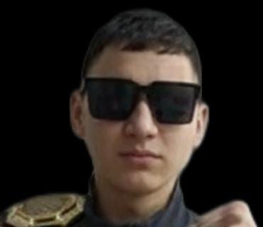
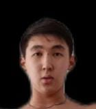
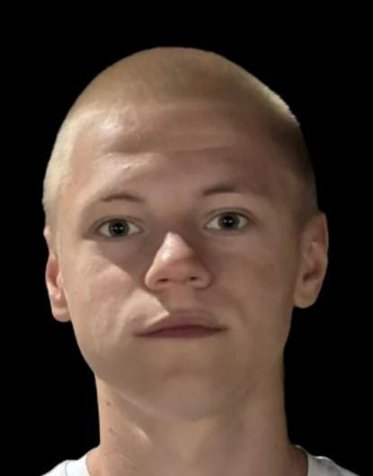

<!DOCTYPE html>
<html lang="ru">
<head>
<meta charset="UTF-8">
<meta name="viewport" content="width=device-width, initial-scale=1.0">
<title>Fight Card</title>

</head>

<body>

    <h1>UFC 343</h1>
    <a class="ufc-link" href="https://AlishkaNepo.github.io/UFC-S/" target="_blank">Перейти на сайт</a>

<!-- ================= БОЙ 1 ================= -->

    

        

            
            
Али

        

        
VS

        

            
            
Бексултан

        

    

    

        Полулегкий вес • Главный бой  
        Судейское решение Р5 05:00
    

<!-- ================= БОЙ 2 ================= -->

    

        

            
            
Роман

        

        
VS

        

            
            
Алихан

        

    

    

        Легкий вес • Со-главный бой  
        Добровольная сдача Р2 02:34
    

</body>
</html>
